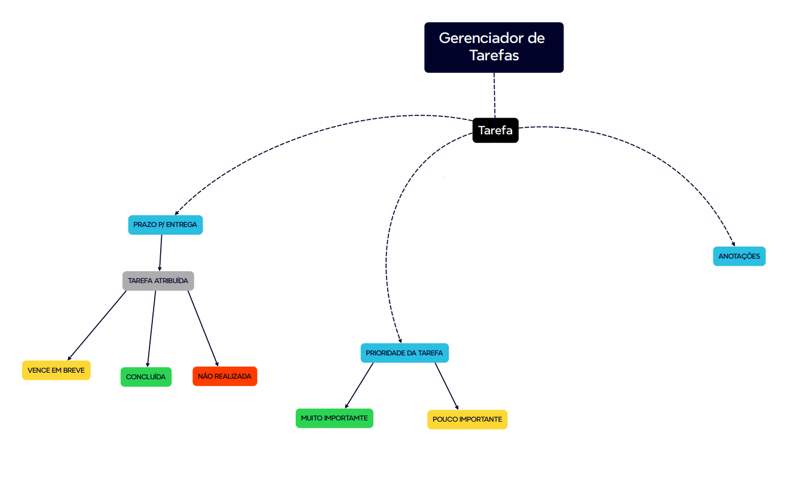

# Projeto_Integrado
Repositório para apresentação dos conteúdos desenvolvidos no PI.

# Projeto
Foi definido entre os integantes do grupo, dentre as opções disponíveis, a criação de uma lista de tarefas.

# Desenvolvimento da Logo do projeto
Para o desenvolvimento da logo, visando alinhamento com a proposta do projeto Lista de tarefas, entendendo que a proposta da lista é organizar a vida do usuário,
seja situações cotidianas, trabalho, vida estudantil.
Buscando alinhar a proposta da solução com um nome e logo que faça sentido e traduza a intenção do projeto, a equipe pensou no nome HoloSync.
O prefixo Holo, vem da necessidade de uma visão Holística que busca uma visão de todo e o sufixo sync traz o entendimento de sincronia, ou seja, uma sincronia do todo.

# Mapa de funcionalidades
A equipe levantou algumas funcionalidades que identificamos serem essenciais para o aplicativo.

# Site map
O fluxo de navegação do site foi definido pela equipe de desenvolvedores para que o usuário ao interagir com o app, possa acessar uma tela Home Page, em seguida é direcionado para a tela de cadastro / login e após a autenticação terá acesso ao aplicativo com a possibilidade de criar ou visualizar as tarefas.

# Fluxograma

